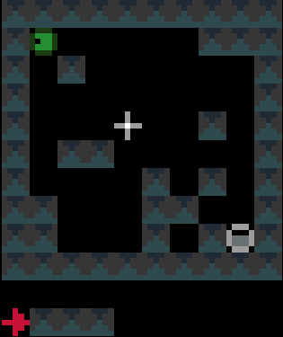

## Goal

The goal of this project is to devise an artificial intelligence that solves a small puzzle game that bares some similarities with the game lemmings, but that is much simpler.
The goal is to get the lemming to reach a target point after N time steps in a 2D vertical map by adding bricks in the map.
It looks like an interesting problem as the AI needs to plan things. Random strategies are very unlikely to provide a solution.
We also want to be able for the AI to learn the rules governing the lemmings behaviour/physics from few examples.

An example of the game with slightly different ending rules (unlimited time steps and the game stop as soon as the lemming reach the target) has been coded in puzzlescript and can be played 
[here](https://www.puzzlescript.net/play.html?p=9d91eaaf7431b00454a6a939369279fd) 

Screenshot:


## Dependencies

* numpy
* matplotlib
* scipy
* pygame (use to display better graphics with sprites)
* imageio (used to save animated gifs)
* scikit-learn
* [PysparseLP](https://github.com/martinResearch/PySparseLP)
* google's ortools for python. https://developers.google.com/optimization/
* Coin-or CBC and CLP executables. download binaries [clp.exe](https://www.coin-or.org/download/binary/Clp/) and [cbc](https://www.coin-or.org/download/binary/Cbc/) and copy them in the solvers\windows subfolder


## Game's rules

We have a 2D map of obstacles in a 2D vertical world with a starting point for the lemming, a starting orientation of the lemming (left or right), a target point. The original obstacles cannot be removed
and the player is only allowed to add obstacles.
Once the player has defines a set of new obstacles, the lemming in released. The goal is to get the lemming to the target point after N time steps.
The physics of the lemmings can be described as follow: 
If there is no obstacle below then lemming goes down one cell, otherwise it moves in the direction (left or right)that it has been previously given if no obstacle is encountered
If there is an obstacle in that direction the lemming changes direction and doesn't move that frame


An example of a problem with a maximum of 3 bricks and 20 time steps


Solution found by adding bricks using Coin-Or CBC Mixed Integer Linear Program (MILP) solver


## Simulation 

A simple python implementation of the lemmings displacement rules:

```python
def lemmingsSimulation(obstaclesMap,targetsMap,lemmingsPositionsInit,lemmingsDirectionsInit,nbFrames):
  # this function simulate lemmings, in order to keep the code as simple as possible we handle the boundary using the modulo operator.
  # therefore obsacle must be added on the boundary to avoid the lemmings reintering the map from the opposite side
  nbLemmings=len(lemmingsPositionsInit)  
  height,width=obstaclesMap.shape
  lemmingsPositions=np.zeros((nbFrames,nbLemmings,2),dtype=np.int32)
  lemmingsDirections=np.zeros((nbFrames,nbLemmings),dtype=np.int32)
  lemmingsPositions[0]=lemmingsPositionsInit.copy()
  lemmingsDirections[0]=lemmingsDirectionsInit.copy()
  
  
  for i in range(1,nbFrames):
    lemmingsDirections[i]=lemmingsDirections[i-1]
    lemmingsPositions[i]=lemmingsPositions[i-1]    
    for i in range(nbLemmings):
      if targetsMap[lemmingsPositions[i-1,i,0],lemmingsPositions[i-1,i,1]]==0:
        if obstaclesMap[(lemmingsPositions[i-1,i,0]+1)%height,lemmingsPositions[i-1,i,1]]==0 :
          lemmingsPositions[i,i,0]=(lemmingsPositions[i-1,i,0]+1) % height
        elif obstaclesMap[lemmingsPositions[i-1,i,0],(lemmingsPositions[i-1,i,1]+lemmingsDirections[i-1,i]) % width]==0:
          lemmingsPositions[i,i,1]=(lemmingsPositions[i-1,i,1]+lemmingsDirections[i,i]) % width          
        else:
          lemmingsDirections[i,i]=-lemmingsDirections[i-1,i]
          
  return lemmingsPositions,lemmingsDirections
	
```


## First method: relax the problem from integer variables to continuous variables

Instead of representing the state of the lemmings at each frame with three integer variables we encode its state using a binary 3D occupancy  map array
full of zeros but one value with a one. 
Using this representation we can rewrite the simulation as follow:

```python

def lemmingsSimulationStateSpace(lemmingsMaps,obstaclesMap,targetsMap,nbFrames):
  for i in range(1,nbFrames):
    for d in range(2):
      s=d*2-1
      lemmingsMaps[i,:,:,d]+=np.roll(lemmingsMaps[i-1,:,:,d]*(1-targetsMap),1,axis=0)*(1-obstaclesMap)
      lemmingsMaps[i,:,:,d]+=np.roll(lemmingsMaps[i-1,:,:,d]*(1-targetsMap),s,axis=1)*(1-obstaclesMap)*np.roll(np.roll(obstaclesMap,s,axis=1),-1,axis=0)
      lemmingsMaps[i,:,:,d]+=lemmingsMaps[i-1,:,:,1-d]*(1-targetsMap)*np.roll(obstaclesMap,s,axis=1)*np.roll(obstaclesMap,-1,axis=0)
      lemmingsMaps[i,:,:,d]+=lemmingsMaps[i-1,:,:,d]*targetsMap 		
```

We did not use logical or and and but addition and multiplication on purpose, this allows us to relax the binary constraint and to be able to simulate with continuous obstacle values on the interval between 0 and 1 that can be interpreted as a kind of density.
We can maximise the score by updating gradually the continuous valued obstacles map using gradient ascent. For the the gradient computation to be efficient, we do not use finite differences but a hand coded reverse accumulation of the gradient (a.k.a adjoint or back-propagation in the neural network context).
The corresponding code is in [lemmingsGradientDescent.py](./lemmingsGradientDescent.py).
The simulation with non zero (0.3) initial values gives:
 
 


The score we are maximising is a not convex and thus may fall in a local minimum. We thus need a careful initialisation with non zero obstacles values in order to get a fraction of the lemmings to reach the target in the initialisation and get on non-zero initial gradient for the method to start changing the obstacles map through gradient descent.
The obstacle evolution through gradient descent gives:
  


We added a small penalty on the obstacle map to encourage using as little new bricks as possible.
However note that not all the cells are binary at convergence. Maybe we need more iterations, break some symmetry by using a slightly different penalty for each cell.
Finally we simulate the lemmings with the found non binary map


## Second method: using a 0-1 integer programming formulation

We can first interpret the problem as solving a non linear program through the introduction of a set of auxiliary variables that represent for each cell the number or density of lemmings coming from the top , the right ,the left and staying on the same cell.
We want to maximise  
```python
score=np.sum(np.sum(lemmingsMaps[-1],axis=2)*targetsMap)
```
with respect to obstaclesMap lemmingsMaps and auxiliaryVariables
under constraints isValid(obstaclesMap, lemmingsMaps, auxVars) is true

```python

def isValid(obstaclesMap, lemmingsMaps, auxVars):
	v=True
  for i in range(1,nbFrames):
    for d in range(2):
      s=d*2-1
      v=v & np.all(auxVars[0,i,:,:,d] == np.roll(lemmingsMaps[i-1,:,:,d]*(1-targetsMap),1,axis=0)*(1-obstaclesMap)))
      v=v & np.all(auxVars[1,i,:,:,d] == np.roll(lemmingsMaps[i-1,:,:,d]*(1-targetsMap),s,axis=1)*(1-obstaclesMap)*np.roll(np.roll(obstaclesMap,s,axis=1),-1,axis=0))
      v=v & np.all(auxVars[2,i,:,:,d] == lemmingsMaps[i-1,:,:,1-d]*(1-targetsMap)*(np.roll(obstaclesMap,s,axis=1))*np.roll(maxDensity*obstaclesMap,-1,axis=0))
      v=v & np.all(auxVars[3,i,:,:,d] == lemmingsMaps[i-1,:,:,d]*targetsMap)  
      v=v & np.all(lemmingsMaps[i,:,:,d] == auxVars[0,i,:,:,d]+auxVars[1,i,:,:,d]+auxVars[2,i,:,:,d]+auxVars[3,i,:,:,d])
	return v
```

Instead of using non linear constraints that involve product between variables, we relax the problem by replacing them by a set of linear inequalities.
We replace a=b*c with binary values by (a<=b)&(a<=c)&(a>=b+c-1).
This allows us to reformulate the problem as a 0-1 integer linear program.
There are several modelling tools that are available to model linear programs from python ([Pulp](https://pythonhosted.org/PuLP),[CyPL](https://github.com/coin-or/CyLP),[Pyomo](http://www.pyomo.org/),[Cvxpy](http://www.cvxpy.org/en/latest/)[Cvxpy](http://www.cvxpy.org/en/latest/))
but none of these allows to handle array of variables with numpy arrays operations like slicing or the roll function that we are using in our python code for the simulation, and we would have to write loops over array elements.
We use our own tool [PySparseLP](https://github.com/martinResearch/PySparseLP) which allows to define easily a set of constraints using several numpy arrays containing variable indices and coefficients.
The python code to formulate the MILP is in [lemmingsMILP.py](./lemmingsMILP.py).
We export the integer linear program into the MPS file format and solve the relaxed linear program (without the integer constraint) using the Coin-Or [CLP](https://www.coin-or.org/download/binary/Clp) executable. We get:

 

Using a brick with density 2/3, the lemming splits into a lemmings with density 1/3 that can walk of bricks with density 1/3 given our set of linear constraints.
Solving the problem with CBC takes about 3 seconds.

We solve the integer linear program (i.e. enforcing the variables to be integers) using Coin-Or [CBC](https://www.coin-or.org/download/binary/cbc) executable. We get


Solving the problem with CBC takes about 10 seconds.
 

## Third method: using a constraints satisfaction solver
 
There are quite a few python tools to formulate problems as SAT problems and to solve them ([or-tools](https://developers.google.com/optimization/), [numberjack](http://numberjack.ucc.ie/ ), [constraint](https://www.logilab.org/project/logilab-constraint)).
 A more exhaustive list can be found [here](./SATPythonTools.md).
I used google's or-tools to formulate and solve the problem. The formulation is written in [lemmingsSAT.py](./lemmingsSAT.py). Unfortunately This tool doesn't allow to define a set of constraint at once using numpy arrays notations, so we have to write each constraint at a time using loops over  array elements.
I find 6 solutions using the constraint that the number of added bricks should less or equal to 3.

 
 
 
 
 
 
 
findind all 6 solutions takes about 10 seconds and making sure there are no other solutions takes about 10 more seconds.
 
## Learning the game's rules from examples


We first generate random maps and simulate the lemming for each of these maps
From this simulated data we learn to predict a cell value from neighbouring  cells in the previous frames
we learn from fully observable state (direction given) as it is much more difficult to learn the rules having access only to the lemmings position and not their orientation as we would then have to either 
learn rules based on an hidden direction state or use a large temporal context with several previous frames, but we would have to get a very large context to go far back in time to guess the 
left/right direction of a falling lemmings.
We use a simple logistic regression but we augment the feature vectors by using product between pairs of variable in the local context.
We then simulate the lemmings using the the trained model with rounding and without rounding the predicted class probability.
The idea behind not rounding is to get a score that is differentiable with respect to the obstacle map and use a simple gradient descent method to solve the problem of estimating the obstacle that 
lead the lemming to the target, as we did previously with the hand coded rules.

simulation with rounding:


simulation without rounding:


Without rounding the predicted probabilities the lemmings density looses a bit o contrast. We use normalisation to keep the sum to one, the lemmings density spreads on some other areas. This is visible if we multiply by 30 the lemmings density to get better contrasted images


We tried a two layers neural network and a decision tree classifier. We get the best result with the decision tree classifier. Even by multiplying the lemmings density by 30 to augment the contrast we don't observe any wrong location of the lemmings.


With enough training data the decision tree seems to learn the right set of rules
The rules to predict lemmings[iFrame,i,j,0] i.e the lemmings values at location i,j pointing toward the left is 

	The binary tree structure to predict lemmings[iFrame,i,j,0] has 17 nodes and has the following tree structure:
	node=0 test node: go to node 1 if lemmings[iFrame-1,i,j,1] <= 0.5 else to node 12.
		node=1 test node: go to node 2 if lemmings[iFrame-1,i,j+1,0] <= 0.5 else to node 7.
			node=2 test node: go to node 3 if lemmings[iFrame-1,i-1,j,0] <= 0.5 else to node 4.
				node=3 leaf node with value 0.
				node=4 test node: go to node 5 if obstacle[iFrame-1,i,j] <= 0.5 else to node 6.
					node=5 leaf node with value 1.
					node=6 leaf node with value 0.
			node=7 test node: go to node 8 if obstacle[iFrame-1,i,j] <= 0.5 else to node 11.
				node=8 test node: go to node 9 if obstacle[iFrame-1,i+1,j+1] <= 0.5 else to node 10.
					node=9 leaf node with value 0.
					node=10 leaf node with value 1.
				node=11 leaf node with value 0.
		node=12 test node: go to node 13 if obstacle[iFrame-1,i,j+1] <= 0.5 else to node 14.
			node=13 leaf node with value 0.
			node=14 test node: go to node 15 if obstacle[iFrame-1,i+1,j] <= 0.5 else to node 16.
				node=15 leaf node with value 0.
				node=16 leaf node with value 1.
					
The rules to predict lemmings[iFrame,i,j,1] i.e. the lemmings values at location i,j pointing toward the right is 					

	The binary tree structure to predict lemmings[iFrame,i,j,1] has 17 nodes and has the following tree structure:
	node=0 test node: go to node 1 if lemmings[iFrame-1,i,j,0] <= 0.5 else to node 12.
		node=1 test node: go to node 2 if lemmings[iFrame-1,i,j-1,1] <= 0.5 else to node 7.
			node=2 test node: go to node 3 if lemmings[iFrame-1,i-1,j,1] <= 0.5 else to node 4.
				node=3 leaf node with value 0.
				node=4 test node: go to node 5 if obstacle[iFrame-1,i,j] <= 0.5 else to node 6.
					node=5 leaf node with value 1.
					node=6 leaf node with value 0.
			node=7 test node: go to node 8 if obstacle[iFrame-1,i,j] <= 0.5 else to node 11.
				node=8 test node: go to node 9 if obstacle[iFrame-1,i+1,j-1] <= 0.5 else to node 10.
					node=9 leaf node with value 0.
					node=10 leaf node with value 1.
				node=11 leaf node with value 0.
		node=12 test node: go to node 13 if obstacle[iFrame-1,i,j-1] <= 0.5 else to node 14.
			node=13 leaf node with value 0.
			node=14 test node: go to node 15 if obstacle[iFrame-1,i+1,j] <= 0.5 else to node 16.
				node=15 leaf node with value 0.
				node=16 leaf node with value 1.


In order to measure how many simulated games need to be used in the training in order ot get the right set of rules, we can generate a huge amount of simulated games and measure the percentage of games that violates the rules as we use more and more of theses games to train the rules.
We could also check that the set of learnt rules is equivalent to the set of hand coded rules using a brute force method by enumerating all possibilities.

Instead of training a decision tree we could use a table for each possible configuration in a small neighbourhood and we can either

* be conservative and assume that any configuration not seen in the training set if forbidden
* be optimistic and assume that any configuration not seen in the training set is allowed
* penalise each configuration depending on how frequent they are in the training dataset

This is similar to naive estimation of potentials in a Markov field.
However we do not want to learn that some obstacle configuration are no permitted regardless of the lemmings position just because they where not existing on the training set.
We do not want to learn the distribution of the obstacle but the distribution of the lemming conditioned to the obstacles.

Instead of learning the rules from random games, we may want the learning system to be *active* and generate query games on which the simulation of the lemmings is run. We aim then at learning the right set of rules with a minimum number of query games.
The learning algorithm would then generates tailored levels from which it can disambiguate rules obtained from previous simulation.


We can learn a DNF using a decisionlist (from artificial intelligence a modern approach). Maybe we could reuse code from 
https://github.com/aimacode/aima-python/blob/master/learning.py.
Maybe we could learn rules using inductive logic programming?(see the *artificial intelligence a modern approach* book)


## Solving the problem with learnt rules
### Using google's constraint solver with learnt rules
Using a tree classifier we encode the tree decision rules as logic expression for each patch and use these to define a Conjunctive Normal Forms (CNF) on the entire set of patches and solve the problem using google's constraint satisfaction solver.

The code is in lemmingsLearnedRulesSAT.py
We convert the decision trees into Conjunctive Normal Forms (CNF) using the function decisionTreeToCNF.
We obtain

    (lemmings[iFrame-1,i,j,1] or lemmings[iFrame-1,i,j+1,0] or lemmings[iFrame-1,i-1,j,0] or not(lemmings[iFrame,i,j,0])) and
    (lemmings[iFrame-1,i,j,1] or lemmings[iFrame-1,i,j+1,0] or not(lemmings[iFrame-1,i-1,j,0] or not(obstacle[iFrame-1,i,j] or not(lemmings[iFrame,i,j,0])) and
    (lemmings[iFrame-1,i,j,1] or not(lemmings[iFrame-1,i,j+1,0] or not(obstacle[iFrame-1,i,j] or not(lemmings[iFrame,i,j,0])) and
    (not(lemmings[iFrame-1,i,j,1] or obstacle[iFrame-1,i,j+1] or not(lemmings[iFrame,i,j,0])) and
    (not(lemmings[iFrame-1,i,j,1] or not(obstacle[iFrame-1,i,j+1] or obstacle[iFrame-1,i+1,j] or not(lemmings[iFrame,i,j,0])) and
    (lemmings[iFrame-1,i,j,1] or lemmings[iFrame-1,i,j+1,0] or not(lemmings[iFrame-1,i-1,j,0] or obstacle[iFrame-1,i,j] or lemmings[iFrame,i,j,0]) and
    (lemmings[iFrame-1,i,j,1] or not(lemmings[iFrame-1,i,j+1,0] or obstacle[iFrame-1,i,j] or lemmings[iFrame,i,j,0]) and
    (not(lemmings[iFrame-1,i,j,1] or not(obstacle[iFrame-1,i,j+1] or not(obstacle[iFrame-1,i+1,j] or lemmings[iFrame,i,j,0])


    (lemmings[iFrame-1,i,j,0] or lemmings[iFrame-1,i-1,j,1] or lemmings[iFrame-1,i,j-1,1] or not(lemmings[iFrame,i,j,1])) and
    (lemmings[iFrame-1,i,j,0] or lemmings[iFrame-1,i-1,j,1] or not(lemmings[iFrame-1,i,j-1,1] or obstacle[iFrame-1,i,j] or obstacle[iFrame-1,i+1,j-1] or not(lemmings[iFrame,i,j,1])) and
    (lemmings[iFrame-1,i,j,0] or lemmings[iFrame-1,i-1,j,1] or not(lemmings[iFrame-1,i,j-1,1] or not(obstacle[iFrame-1,i,j] or not(lemmings[iFrame,i,j,1])) and
    (lemmings[iFrame-1,i,j,0] or not(lemmings[iFrame-1,i-1,j,1] or not(obstacle[iFrame-1,i,j] or not(lemmings[iFrame,i,j,1])) and
    (not(lemmings[iFrame-1,i,j,0] or obstacle[iFrame-1,i,j-1] or not(lemmings[iFrame,i,j,1])) and
    (not(lemmings[iFrame-1,i,j,0] or not(obstacle[iFrame-1,i,j-1] or obstacle[iFrame-1,i+1,j] or not(lemmings[iFrame,i,j,1])) and
    (lemmings[iFrame-1,i,j,0] or lemmings[iFrame-1,i-1,j,1] or not(lemmings[iFrame-1,i,j-1,1] or obstacle[iFrame-1,i,j] or not(obstacle[iFrame-1,i+1,j-1] or lemmings[iFrame,i,j,1]) and
    (lemmings[iFrame-1,i,j,0] or not(lemmings[iFrame-1,i-1,j,1] or obstacle[iFrame-1,i,j] or lemmings[iFrame,i,j,1]) and
    (not(lemmings[iFrame-1,i,j,0] or not(obstacle[iFrame-1,i,j-1] or not(obstacle[iFrame-1,i+1,j] or lemmings[iFrame,i,j,1])

We add the extra rules that the number of lemmings on the target should sum to one on the last frame and the constraint that we use a limited number of bricks. This last constraint is a cardinality constraint that might be tricky to convert to Conjunctive Normal Forms [6,7] if we want to use a SAT solver that need the problem to be formulated a a conjunctive normal form like minisat (not that some code based on minisat like [minsatp](https://github.com/niklasso/minisatp) or [minicard](https://github.com/liffiton/minicard) handles cardinality constraints).
 
Fortunately cardinality constraints are handled by google's constraint programming tool.
The solver find the 6 solutions. We note that finding all 6 solutions using the learnt rules is about 10 times slower than with the hand coded rules ( 110 seconds vs 10 seconds) and making sure all solution have been found much longer (205 seconds vs 22 seconds).


Maybe we could remove to variables in some of the clauses which could make the problem easier for SAT solvers to solve (maybe see Quinlan 1987).
We may actually want to get more rules than the strict minimum and have some redundancy and larger contexts in order to make it easier for tree search based SAT solver to prune nodes.
Is this approach a bit similar to clause learning in SAT solvers? We do not want too many clauses but we want clauses that can help to prune bad solution quickly.

### Using Integer programming with learnt rules

We can convert each clauses in the CNF formula to a linear inequality and solve the problem using an integer programming solver like coin-or CBC or a pseudo Boolean optimisation solver like [minicard](https://github.com/liffiton/minicard).

## Generating difficult solvable games

We can generate random game and then try to find the solution with a minimum number of bricks. We can try to solve with one brick, then two etc
or use a integer programming solver with a penalisation on the number of added bricks.
in order to be able to generate quickly feasible games we want to be able to discard quickly unfeasible games.


## Using other methods like convex input neural network or OptNet

I could have a better look at some structured-learning methods like

* OptNet [paper](https://arxiv.org/abs/1703.00443), [code](https://github.com/locuslab/optnet)
* Unifying Local Consistency and MAX SAT Relaxations for Scalable Inference with Rounding Guarantees. [paper](https://en.wikipedia.org/wiki/Markov_logic_network)
* Hinge-Loss Markov Random Fields and Probabilistic Soft Logic. [paper](https://arxiv.org/pdf/1505.04406.pdf),[code](http://psl.linqs.org/)
* Input-Convex Neural Network [paper](https://arxiv.org/abs/1609.07152), [code](https://github.com/locuslab/icnn)


## Other add-hoc or heuristic methods

We generate a set of solved problem examples obtained either by generating random game and solving them with one of the method above or using a method that generate solution and then removed bricks to generate a problem.
From this set of examples we can learn some heuristic function that predict for example a lower bound on the the number of bricks that are needed to solve the problem.
We then add one brick at a time and perform an A* search using this heuristic.
Note that at each time we add a brick, there is no point trying to add a brick that is not on the lemmings trajectory, can this be learnt by the machine ?
 

maybe use approach like

* Learning Generalized Reactive Policies Edward Groshev using Deep Neural Networks https://arxiv.org/pdf/1708.07280.pdf
* Imagination-Augmented Agents for Deep Reinforcement Learning https://arxiv.org/pdf/1707.06203.pdf

## Modeling with a game description language 

some links:

* http://www.cig2017.com/competitions-cig-2017/#anchor1
* https://en.wikipedia.org/wiki/General_game_playing
* http://www.ai.univ-paris8.fr/~jm/ggp/

### Standford Game Description Language 

One of the most popular [Game Description Language](https://en.wikipedia.org/wiki/Game_Description_Language) is the GDL component of the Stanford General Game Playing Competition.
The language is a special-purpose language based on first-order logic which is capable of modelling a large diversity of turn-taking board games with perfect information or games that share
similar qualities. However the language is ill-suited for defining video game with random components, missing information or complex dynamics. 
 

### PyVGDL

Other descriptive language such as the Video Game Description Language [31] have been proposed to be overcome the Standford Game Description Language limitations in order to be able to desribe most 2D arcade games.
It is said in [32]that
*"VGDL is inspired by GDL (Love et al. 2008), which is used for the GGP competitions. However, while GDL describes games based on logical rules (or true facts), VGDL defines the entities and interactions that can take place in the game. The dynamics of each one of these components, such as movements and behaviour, are programmed in the framework. Albeit this requires that a given functionality is implemented in the system when creating new games, it provides more flexibility and a larger space of games that can be designed. While GDL is restricted to board games, VGDL enables the definition of a wide range of arcade and puzzle games."*
We modeled our game using the [PyVGDL](https://github.com/schaul/py-vgdl) library [31] .
The game description in the VGDL format is [here](lemmings.vgdl). The library pyVGL provides functionalties that can be used to learn the behavior of a bot that solves the game.

### Puzzlescript

Getting inspiration from [Bouncers](https://www.puzzlescript.net/play.html?p=9675709), we coded our game in puzzlescript with a slightly different ending rule (unlimited time steps, the game stop as soon as the lemming reach the target). The game can be played [here](https://www.puzzlescript.net/play.html?p=cff599a56debf30a601b2f5436ae90fa) with source code [here](https://www.puzzlescript.net/editor.html?hack=cff599a56debf30a601b2f5436ae90fa)
A general AI for games expressed in the puzzlescript language has been proposed in [39]. Some code is available online:

* https://github.com/icelabMIT/PuzzleScriptAI
* https://github.com/Moofkin/PuzzleScript-Solver

An improved version seemed to have been develop by authors in [44] 
but it does not seem that the code is available online.

### Zillions of Games

[Zillions of Games](https://en.wikipedia.org/wiki/Zillions_of_Games) is a commercial software that comes with a game description language and solvers
We could write ou game in the zillions of gamers format and solve it using the packaged solvers.  
However we would like the AI to be able to play without having access to the description in such a language but to be able to learn the game's rules through interaction with the game or passive observation of games.


## Exposing the game through a standardized API

We could follow the API used in  [32] used for the [GVGAI competition](http:\\www.gvgai.net) to allow the agent to query the game status (winner, time step, score), the player's state (position,
orientation, resources), history of events or collisions during
the game, and position of the different sprites in the level,identified only by an integer id for its type.
Additionally, one of the main resources the agents have to reason about the environment is the forward model provided by the framework.


## Other games
 
Some 2D games where we could apply the same approach to learn the rules from examples and then solve new instances with the learned rules


Some games with gravity:

* Fire N' Ice (aka Solomon's Key 2): [gameplay video](https://www.youtube.com/watch?v=1t782B0zK3Y)
* [iso ball 2D](https://play.google.com/store/apps/details?id=net.asort.isoball2d&hl=en) 
* [gravnix](https://www.youtube.com/watch?v=k3iZqXxbnWc)
* same. python implementation available [here](https://github.com/opethe1st/SameGame)

Sokoban and variants

* sokoban clone in python described [here](https://inventwithpython.com/pygame/chapter9.html) or [here](http://www.pygame.org/project-Sokoban-1587-.html)
* [laser tank](https://en.wikipedia.org/wiki/LaserTank)
* kye. There is python clone available [here](http://games.moria.org.uk/kye/)
* some sokoban variants listed [here](http://sokoban-jd.blogspot.fr/2013/04/sokoban-variants.html)
* [polar slide](http://game-game.com/28523/) (a sokoban variant with slidings blocks). We could learn rules from random generated moves of the player  
* Solomon's Key. gameplay video [here](https://www.youtube.com/watch?v=ADB15SFW6hQ)
* [unger](http://puzzlesea.com/unger)
* [Atomix](https://en.wikipedia.org/wiki/Atomix_(video_game)). Open source clone [here](http://atomiks.sourceforge.net/)
* [Oxyd](https://en.wikipedia.org/wiki/Oxyd)
* Xor. Clone [here](http://jwm-art.net/?p=XorCurses)

Some Puzzlescript games that seem interesting to test our method:

* [Atomix](https://www.puzzlescript.net/play.html?p=e4301869b762605f976b8f1c86fc70d3)
* [marble shoot](https://www.puzzlescript.net/play.html?p=d688de5e0e1e978f63fd)
* [atlas shrank](https://www.puzzlescript.net/play.html?p=6994394)
* [Bouncers](https://www.puzzlescript.net/play.html?p=9675709)	
* [Boulderdash](https://www.puzzlescript.net/play.html?p=a67f26e3fa335dd8804d)
* [cratopia](https://www.puzzlescript.net/play.html?p=7114130)
* [rush hour](https://www.puzzlescript.net/play.html?p=58d491ad92403872ee21)


other games that could be of interest to test our method

* peg solitaire: we learn rules from examples of valid moves
* rushhour. several python implementation (https://github.com/ryanwilsonperkin/rushhour,https://github.com/besuikerd/RushHour). gameplay https://www.youtube.com/watch?v=6sDl_MiivqU&t=7s
* boulder dash. Pytohn clone here https://github.com/irmen/bouldercaves,https://www.pygame.org/project/2894
* minidungeons http://minidungeons.com/
could have a look at https://en.wikipedia.org/wiki/List_of_puzzle_video_games

## The Arcade Learning Environment

The Arcade Learning Environment (ALE) is developed by Bellamare et. al [45]and used by e.g. Google DeepMind. ALE includes games from the Atari 2600 emulator, which are simple 2D arcade games with rudimentary graphics. ALE controllers are given as input the raw screen capture and a score counter, and they must be able to indicate the set of buttons that determines the next action to make in the game.

## Some references

* [1] *Partial Formalizations and the Lemmings Game*. John McCarthy. 1994. [download](http://jmc.stanford.edu/articles/lemmings/lemmings.pdf)
* [2] *Scripting the Game of Lemmings with a Genetic Algorithm*. Graham Kendall and Kristian Spoerer. Congress on Evolutionary Computation, 2004. ECEC2004. 
[download](http://www.cs.nott.ac.uk/~pszgxk/papers/cec2004kts.pdf)
* [3] *The Lemmings Puzzle: Computational Complexity of an Approach and Identification of Difficult Instances*. Kristian Spoerer. PhD Thesis. University of Nottingham 2007
[download](http://citeseerx.ist.psu.edu/viewdoc/download?doi=10.1.1.109.7654&rep=rep1&type=pdf)
* [4] *Micro and macro lemmings simulations based on ants colonies*. 	Antonio Gonzalez-Pardo, Fernando Palero, David Camacho. EvoApplications 2014
* [5] *Lemmings is PSPACE-complete*. Giovanni Viglietta. Theoretical Computer Science. 2012. [download](https://arxiv.org/pdf/1202.6581.pdf)
* [6] *Towards Robust CNF Encodings of Cardinality Constraints*. Joao Marques-Silva and Ines Lynce[download](http://www.inesc-id.pt/ficheiros/publicacoes/4125.pdf)
* [7] *Game Engine Learning from Video*. Matthew Guzdial, Boyang Li, Mark O. Riedl [download](https://www.cc.gatech.edu/~riedl/pubs/ijcai17.pdf)
* [8] *Stochastic Variational Video Prediction*.  [download](https://arxiv.org/pdf/1710.11252.pdf)
* [9] *New Approaches to Constraint Acquisition*.ICON book chapter. C. Bessiere, R. Coletta,A. Daoudi, E. Hebrard, G. Katsirelos, N. Lazaar, Y. Mechqrane, N. Narodytska, C.G. Quimper, and T. Walsh. http://www.lirmm.fr/ConstraintAcquisition/
* [10] *Learning DNF Formulas*. Shie Mannor and Shai Shalev-Shwartz.  [download](https://www.cs.huji.ac.il/~shais/DNF.pdf)
* [11] *Learning DNF by Decision Trees*. Giulia Pagallo.  [download](http://citeseerx.ist.psu.edu/viewdoc/download;jsessionid=65FF15062DDE3449803BBC66EBA87877?doi=10.1.1.104.573&rep=rep1&type=pdf) by Giulia Pagallo 
* [12] *A  Scheme  for  Feature  Construction  and  a  Comparison  of Empirical  Methods*. Der-Shung Yang, Larry Rendell, Gunnar Blix.  [download](https://www.ijcai.org/Proceedings/91-2/Papers/014.pdf)
* [13] *Generating production rules from decision trees*.     J.R.  Quinlan In IJCAI 1987.  
* [14] *Graph Neural Networks and Boolean Satisfiability*. Benedikt Bunz, Matthew Lamm. 2017.  [download](https://arxiv.org/pdf/1702.03592.pdf)
* [15] *Learning pseudo-Boolean k-DNF and Submodular Functions*. Sofya Raskhodnikova, Grigory Yaroslavtsev. [ download](https://arxiv.org/pdf/1208.2294.pdf)
* [16] *An O(n log(log(n))) Learning Algorithm For DNF under the Uniform Distribution*. Yishay Mansour.  [Download](http://www.cs.columbia.edu/~rocco/Teaching/S12/Readings/Mansour.pdf)
* [17] *Learning DNF from Random Walks*. Nader Bshouty.  [download](https://www.cs.cmu.edu/~odonnell/papers/random-walks.pdf)
* [18] *Learning Complex Boolean Functions:Algorithms and Applications* Arlindo L. Oliveira and Alberto Sangiovanni-Vincentelli.  [download](https://papers.nips.cc/paper/857-learning-complex-boolean-functions-algorithms-and-applications.pdf)
* [19] *On Construction of Binary Higher Order Neural Networks and Realization of Boolean Functions*. Poorva Agrawal and Aruna Tiwari.  [download](https://www.ijcait.com/IJCAIT/12/1213.pdf)
* [20] *Binary Higher Order Neural Networks for Realizing Boolean Functions*. Chao Zhang. [download ](https://pdfs.semanticscholar.org/45ac/ac17a71e43f2a70c820ce7f4b6b6299b3175.pdf)
* [21] *Realization of Boolean Functions Using Binary Pi-sigma Networks*. Yoan Shin and Joydeep Ghosh. [download](http://citeseerx.ist.psu.edu/viewdoc/download?doi=10.1.1.52.9813&rep=rep1&type=pdf)
* [22] *Towards Deep Symbolic Reinforcement Learning* Marta Garnelo, Kai Arulkumaran and Murray Shanahan. [download ](https://arxiv.org/pdf/1609.05518.pdf)
* [23] *OptNet: Differentiable Optimization as a Layer in Neural Networks* Brandon Amos, J. Zico Kolter. [paper](https://arxiv.org/abs/1703.00443), [code](https://github.com/locuslab/optnet)
* [24] *Unifying Local Consistency and MAX SAT Relaxations for Scalable Inference with Rounding Guarantees*.Stephen H. Bach, Bert Huang,Lise Getoor. [paper](http://proceedings.mlr.press/v38/bach15.pdf)
* [25] *Hinge-Loss Markov Random Fields and Probabilistic Soft Logic*. Stephen H. Bach, Matthias Broecheler, Bert Huang, Lise Getoor. [paper](https://arxiv.org/pdf/1505.04406.pdf),[code](http://psl.linqs.org/)
* [26] *Input-Convex Neural Network* [paper](https://arxiv.org/abs/1609.07152). Brandon Amos, Lei Xu, J. Zico Kolter [code](https://github.com/locuslab/icnn)
* [27] *Learning Generalized Reactive Policies Edward Groshev using Deep Neural Networks*. Edward Groshev, Aviv Tamar. [paper](https://arxiv.org/pdf/1708.07280.pdf)
* [28] *Imagination-Augmented Agents for Deep Reinforcement Learning*. Theophane Weber Sebastien Racaniere David P. Reichert Lars Buesing Arthur Guez Danilo Rezende Adria Puigdomenech Badia Oriol Vinyals Nicolas Heess Yujia Li Razvan Pascanu Peter Battaglia David Silver Daan Wierstra [paper](https://arxiv.org/pdf/1707.06203.pdf)
* [29] *General Game Playing with Stochastic CSP* Frederic Koriche · Sylvain Lagrue Eric Piette Sebastien Tabaryhttp://www.cril.univ-artois.fr/~epiette/papers/constraints15.pdf
* [30] *Stochastic Constraint Programming for General Game Playing with Imperfect Information* Frederic Koriche, Sylvain Lagrue, Eric Piette, and Sebastien Tabary http://www.cril.univ-artois.fr/~epiette/papers/giga16.pdf
* [31] *A Video Game Description Language for Model-based or Interactive Learning*. Tom Schaul. Proceedings of the IEEE Conference on Computational Intelligence in Games 2013. [paper] (http://citeseerx.ist.psu.edu/viewdoc/download?doi=10.1.1.435.61&rep=rep1&type=pdf)
* [32] *General Video Game AI: Competition, Challenges, and Opportunities* https://www.aaai.org/ocs/index.php/AAAI/AAAI16/paper/download/11853/12281
* [33] *General Video Game Level Generation* Ahmed Khalifa, Diego Perez-Liebana. [paper](http://game.engineering.nyu.edu/wp-content/uploads/2016/05/general-video-game.pdf)
* [34] *Marahel: A Language for Constructive Level Generation* Ahmed Khalifa and Julian Togelius(http://www.akhalifa.com/documents/marahel-language-constructive.pdf)
* [35] *The 2014 General Video Game Playing Competition* Diego Perez, Spyridon Samothrakis, Julian Togelius, Tom Schaul, Simon M. Lucas, Adrien Couetoux, Jerry Lee, Chong-U Lim, Tommy Thompson *http://repository.essex.ac.uk/14619/1/GVGAI2014Competition.pdf
* [36] https://github.com/mgbellemare/Arcade-Learning-Environment
* [37] *General Video Game Playing* John Levine, Clare Bates Congdon, Marc Ebner, Graham Kendall, Simon M. Lucas, Risto Miikkulainen, Tom Schaul, and Tommy Thompson. [paper](http://people.idsia.ch/~tom/publications/dagstuhl-gvgp.pdf)
* [38] *Towards a Video Game Description Language* Marc Ebner1, John Levine2, Simon M. Lucas3, Tom Schaul, Tommy Thompson , and Julian Togelius [paper](http://julian.togelius.com/Ebner2013Towards.pdf)
* [39] *An Approach to General Videogame Evaluation and Automatic Generation using a Description Language* Chong-U Lim and D. Fox Harrell [paper](http://groups.csail.mit.edu/icelab/sites/default/files/pdf/Lim2014approach.pdf)
* [40] *Automatic Puzzle Level Generation: A General Approach using a Description Language*. Ahmed Khalifa and Magda Fayek. http://www.ccgworkshop.org/2015/Khalifa.pdf
* [41] *The 2014 General Video Game Playing Competition* Diego Perez, Spyridon Samothrakis, Julian Togelius, Tom Schaul, Simon M. Lucas, Adrien Couetoux, Jerry Lee, Chong-U Lim, Tommy Thompson http://diego-perez.net/papers/GVGAI2014Competition.pdf
* [42] *Bandit-based Search for Constraint Programming Manuel Loth*, Michele Sebag, Youssef Hamadi, Marc Schoenauer
* [43] *Monte-Carlo Tree Search for the Maximum Satisfiability Problem*
* [44] *Evaluating a Solver-Aided Puzzle Design Tool* Joseph C. Osborn Michael Mateas. [pdf](http://ceur-ws.org/Vol-1907/3_mici_osborn.pdf )
* [45] *The Arcade Learning Environment: An Evaluation Platform for General Agents*  Bellemare, Naddaf, Veness,Bowling. Journal of Artificial Intelligence Research 2013
